# 🎬 MovieTop21

## IFTS29 - Desarrollo Front End - TP3  
**Grupo 21**

---

### Integrantes

- 👩‍💻**Neuyin Herrera** — *(Neuyin)*  
- 👨‍💻**Erick Romero** — *(Erick)*  

---

## 🏷️ Título del Proyecto

**MovieTop21**  
En nuestro sitio web conocerás más sobre nosotros y sobre nuestros intereses cinéfilos.

---

## 📝 Descripción del proyecto

**MovieTop21** es un proyecto académico colaborativo enfocado en el desarrollo de sitios y aplicaciones web modernas. Nació como un equipo creativo dentro de la materia Desarrollo de Sistemas Web (Front End) en el IFTS N°29, con el objetivo de aplicar las tecnologías aprendidas (HTML, CSS, JavaScript y React) en proyectos reales.  

Cada perfil presenta:
- Información personal y profesional del desarrollador.
- Habilidades técnicas y blandas.
- Otros proyectos realizados.
- Películas y música favoritas.
- Redes sociales.

Además, incorporamos el consumo de una API pública donde conocerás las películas de anime más aclamadas por el público.

---

## Tecnologías Utilizadas

- **Vite** — Entorno de desarrollo rápido para React.  
- **React.js** — Librería principal para la construcción de componentes.  
- **React Router DOM** — Navegación entre vistas y perfiles.  
- **CSS Modules / Stylesheets** — Estilos personalizados por integrante.  
- **JavaScript (ES6+)** — Lógica y manejo de datos.  
- **API** — Fuente de datos para componentes dinámicos.  

---

## 🧩 Capturas de pantalla


### Captura de pantalla de la mejora 1: Mejora de la Interfaz con animaciones suaves entre paginación

Antes navegar entre las páginas se sentía rígido y estático:
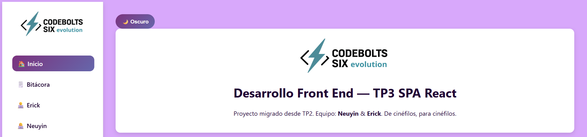

Ahora logramos una paginación más suave y dinámica al navegar por el sitio:
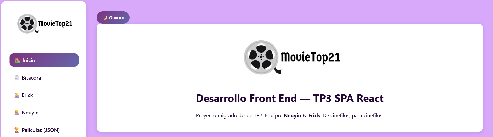

### Captura de pantalla de la mejora 2: Búsqueda/Filtrado en JSON Local

Antes y ahora se ha podido filtrar la búsqueda en nuestro JSON local:
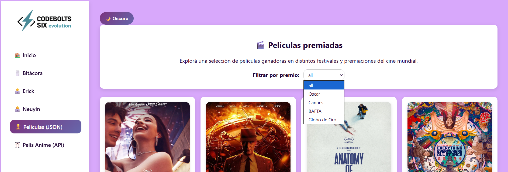

### Captura de pantalla de la mejora 3: Galería de Imágenes Interactiva

Antes solo había una pequeña animación en las imágenes:
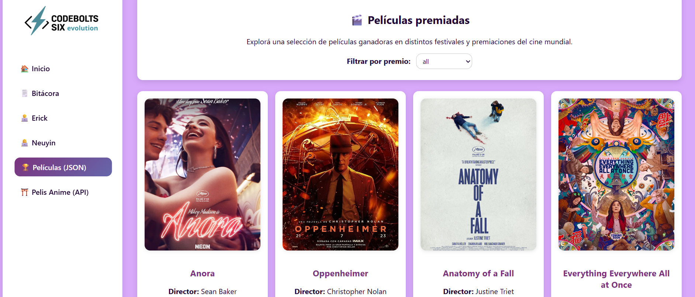

Ahora podés abrir las imágenes, cuenta con lightbox con navegación y tecla ESC o el botón X para cerrar:
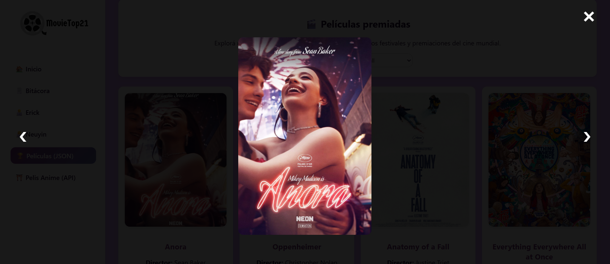

### Captura de pantalla de la mejora 4: Barras de Progreso de Habilidades

Antes solo aparecían las habilidades:
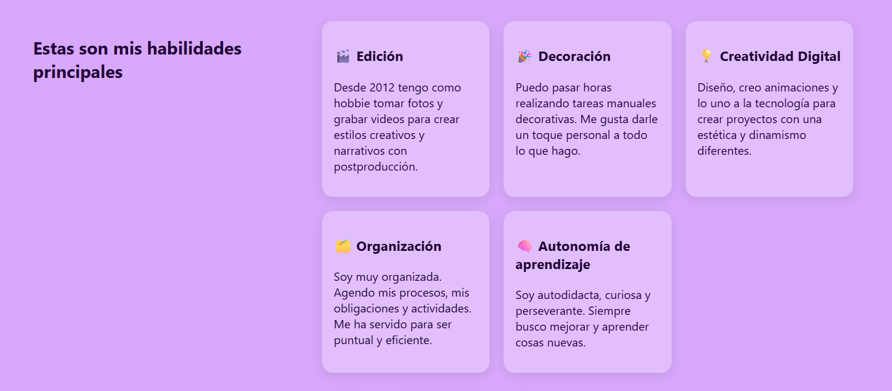

Ahora aparecen las habilidades con una barra de progreso:
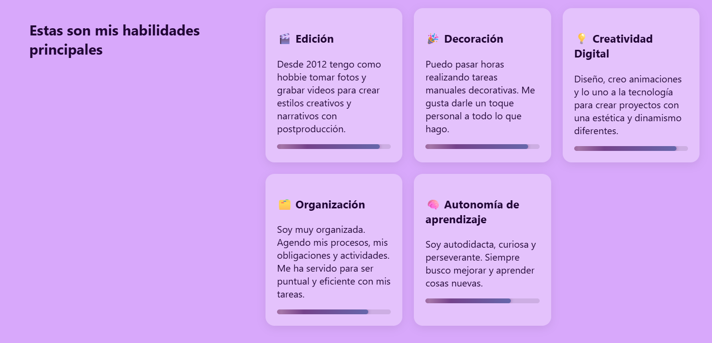

### Captura de pantalla de la mejora 5: Botones de Redes Sociales animados

Antes no existían los botones de redes sociales:
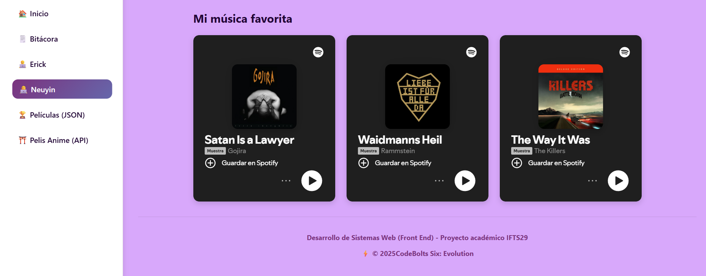

Ahora aparecen botones de redes sociales animados:
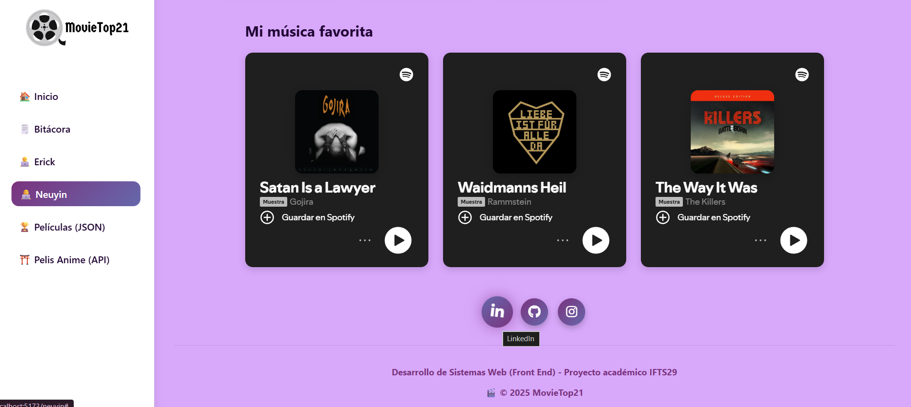

### Captura de pantalla de la mejora 6: Carousel de Proyectos Destacados

Antes no existía el carousel, ahora lo implementamos incluyendo un componente más:
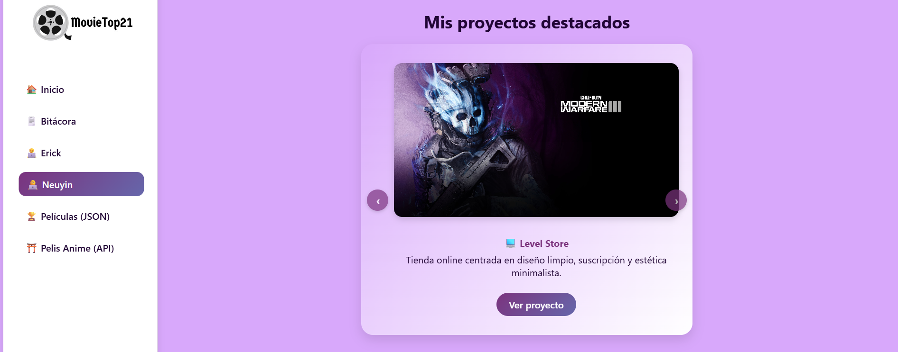

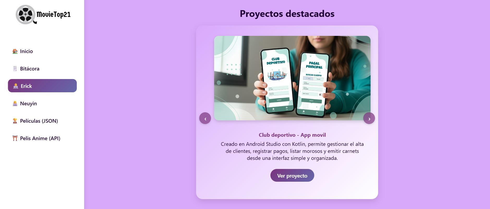

---

## Estructura de archivos del proyecto
```bash
Ccodeboltssix-tp3/
│
├── node_modules/
│   └── resto de archivos
│
├── public/
│   ├── assets/
│   │   └── capturas
│   │      └── resto de imágenes
│   │
│   ├── images/
│   │   ├── logo.png
│   │   ├── logooscuro.png
│   │   ├── neuyin.png
│   │   ├── erick.png
│   │   └── resto de imágenes
│   │        
│   └── favicon.ico
│
├── src/
│   ├── components/
│   │   ├── ApiPublica.jsx
│   │   ├── AppLayout.jsx
│   │   ├── Bitacora.jsx
│   │   ├── CardIntegrante.jsx
│   │   ├── CarruselProyectos.jsx
│   │   ├── Footer.jsx
│   │   ├── Home.jsx
│   │   ├── Json.Data.jsx
│   │   ├── PerfilErick.jsx
│   │   ├── PerfilNeuyin.jsx
│   │   └── Sidebar.jsx
│   │
│   ├── data/
│   │   └── items.json
│   │
│   ├── App.css
│   ├── App.jsx
│   ├── index.css
│   └── main.jsx
│
├── .gitignore
├── index.html
├── package-lock.json
├── package.json
├── README.md
└── vite.config.js